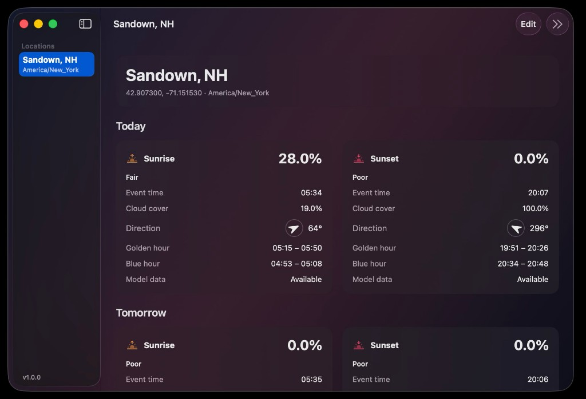
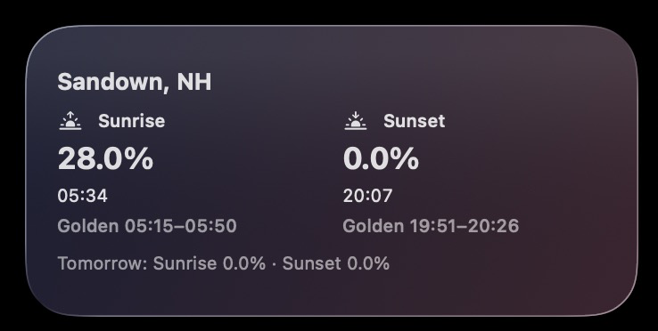

# SunsetHue for macOS

Unofficial native macOS app (and optional WidgetKit extension) that shows SunsetHue sunrise and sunset forecast quality for one or more saved locations.

**This project is unofficial and is not reviewed, endorsed, or supported by SunsetHue or Apple.**

## Screenshots

<p>
  
</p>

<p>
  
</p>

## Free GitHub distribution (no Apple Developer account)

This project ships **unsigned** GitHub Release builds for free (no paid Apple Developer Program):

- Download: unsigned DMG — main app only for end users
- Settings and forecast cache: `~/Library/Application Support/SunsetHue/`
- API key: login Keychain only (never written to disk files or logs)
- Desktop widgets: use a signed Personal Team Debug build from Xcode (App Sandbox + Team-ID App Group); not available from the unsigned DMG
- Versions: semver via Conventional Commits + release-please (see [CONTRIBUTING.md](CONTRIBUTING.md))

### Download and open (end users)

[Download SunsetHue for macOS (DMG)](https://github.com/andrewtryder/sunsethue-macos/releases/latest/download/SunsetHue-macos-unsigned.dmg)

1. Open the DMG and drag **SunsetHue** into **Applications**.
2. **Right-click** `SunsetHue.app` → **Open** → **Open**  
   (Gatekeeper blocks unsigned apps until you confirm once.)
3. Optional terminal override:

```bash
xattr -dr com.apple.quarantine /Applications/SunsetHue.app
```

4. Add your SunsetHue API key and at least one location.

### Build release DMG (maintainers)

```bash
python3 scripts/verify_release_metadata.py
./scripts/package-unsigned.sh
# → dist/SunsetHue-<version>-macos-unsigned.dmg
# → dist/SunsetHue-macos-unsigned.dmg   # stable name for latest/download
```

On `main`, release-please opens version PRs from Conventional Commits and, when merged, tags a release and uploads the unsigned DMG assets automatically.

### Keychain password prompts

The API key is stored in the **data-protection keychain** with Keychain Sharing (signed builds), so opening the app from a widget deep link should not ask for your login password. If macOS still prompts once after upgrading, open the app, edit a location, and re-save the API key — that migrates the old file-keychain item. Prefer a single install (for example `/Applications/SunsetHue.app`) while testing widgets so Launch Services does not start a second copy from Xcode DerivedData.

### Widget gallery (important)

macOS **will not list** a WidgetKit extension from an unsigned / ad-hoc build. That is why SunsetHue does not appear under Edit Widgets when you run the free GitHub Release binary.

The **main app** is the supported product for unsigned releases.

To see the widget on your own Mac (still free — no $99 program):

1. Create a free [Apple ID](https://appleid.apple.com) if you do not have one.
2. Xcode → Settings → Accounts → add that Apple ID.
3. Copy `Config/Local.xcconfig.example` → `Config/Local.xcconfig` and set your **Personal Team** ID, **or** in the `SunsetHue` and `SunsetHueWidget` targets enable **Automatically manage signing** and pick your Personal Team.
4. Confirm both targets have **App Sandbox**, **App Groups** (`$(TeamIdentifierPrefix)group.com.andrewtryder.SunsetHue`), and **Keychain Sharing** (entitlements are in the repo; Xcode may ask to register the App Group — accept).
5. **Product → Run** from Xcode (Debug, signed — not the unsigned Release DMG).
6. Right-click the desktop → **Edit Widgets** → search **SunsetHue**.

If the widget shows **Open SunsetHue to add a location** while the app already has locations, or an old **unsigned** placeholder: on macOS 15+ the widget cannot read iOS-style `group.*` App Groups (silent deny). This project uses the Team-ID-prefixed group `$(TeamIdentifierPrefix)group.com.andrewtryder.SunsetHue`. Also remove/re-add the widget after replacing a stale `/Applications/SunsetHue.app`, and do not open unsigned Release DMG builds while testing widgets.

WidgetKit extensions must be sandboxed and development-signed or macOS will not list them.

Paid Apple Developer Program is only needed for notarized distribution to other people—not for widgets on your machine.

## Requirements

- macOS 14 or newer
- To build from source: Xcode 15+ (Xcode 26 recommended) and optionally [XcodeGen](https://github.com/yonaskolb/XcodeGen)
- A SunsetHue API key from [sunsethue.com/dev-api](https://sunsethue.com/dev-api)

## Project layout

| Path | Purpose |
|------|---------|
| `Sources/SunsetHueCore` | Shared Swift package: API, models, Keychain, file storage, dates |
| `Tests/SunsetHueCoreTests` | Unit tests (no live network) |
| `SunsetHue` | Main macOS SwiftUI app |
| `SunsetHueWidget` | WidgetKit + App Intents extension (best-effort when unsigned) |
| `scripts/package-unsigned.sh` | Builds unsigned GitHub Release DMG |
| `project.yml` | XcodeGen project definition |

## Identifiers

| Item | Value |
|------|--------|
| App bundle ID | `com.andrewtryder.SunsetHue` |
| Widget bundle ID | `com.andrewtryder.SunsetHue.Widget` |
| Shared data folder | `~/Library/Application Support/SunsetHue/` |
| URL scheme | `sunsethue` |
| Location deep link | `sunsethue://location/<location-id>` |

Organization / copyright display name: **Andrew Tryder**.

Optional App Group / Keychain Sharing identifiers remain documented only for contributors who later add a paid Apple team:

| Optional (signed builds) | Value |
|--------------------------|--------|
| App Group | `$(TeamIdentifierPrefix)group.com.andrewtryder.SunsetHue` (macOS 15+ Team-ID form) |
| Keychain Access Group | `$(AppIdentifierPrefix)com.andrewtryder.SunsetHue.shared` |

## Obtaining an API key

1. Visit [https://sunsethue.com/dev-api](https://sunsethue.com/dev-api).
2. Create an API key with SunsetHue.
3. Paste it into the app. It is stored **only** in the Keychain.

## Building from source

```bash
# Unit tests (no live API)
swift test --package-path .

# Regenerate the Xcode project if you edit project.yml
xcodegen generate

# Unsigned build (default for this repo)
xcodebuild -scheme SunsetHue -destination 'platform=macOS' \
  -derivedDataPath build/DerivedData \
  CODE_SIGNING_ALLOWED=NO CODE_SIGNING_REQUIRED=NO CODE_SIGN_IDENTITY=- build
```

Or open `SunsetHue.xcodeproj` in Xcode and run the `SunsetHue` scheme (signing can stay off).

## Privacy behavior

- API key: Keychain only
- Locations, preferences, cached forecasts, timestamps, non-sensitive errors: Application Support JSON files
- Never log API keys, request headers, or precise private coordinates at normal log levels
- Optional Core Location fills coordinates only when requested; manual entry always works

## Testing

```bash
swift test --package-path .
```

Tests use `MockHTTPTransport` and fixtures. They never call the live API.

## Known WidgetKit limitations

- WidgetKit controls real refresh timing; 6 / 12 / 24 hour intervals are preferences
- Unsigned / free builds may not give the widget reliable access to shared data or Keychain
- Transient failures keep the last cached forecast in the app
- Auth failures prompt you to update the API key in the app

## Optional: signed builds later

If you later join the Apple Developer Program and want a notarized widget-capable build for other people, notarize with a Developer ID certificate. Local Personal Team signing already covers widgets on your Mac. Until then, ship `./scripts/package-unsigned.sh` (DMG).

## License

MIT — see [LICENSE](LICENSE).
